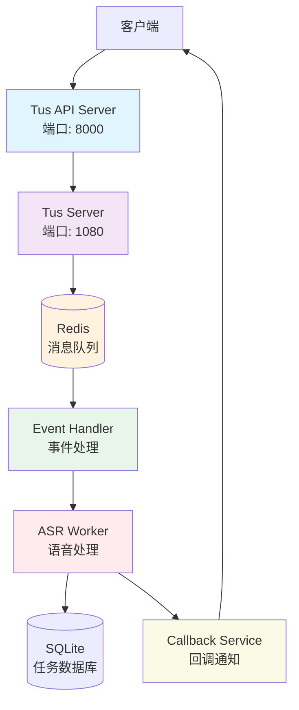

# Tus.io ASR System

基于 Tus.io 协议的语音转录系统，提供大文件可续传上传和分布式处理能力。

## 🎯 系统架构



## 🚀 快速开始

### 1. 启动系统

```bash
# 使用便捷启动脚本
./start-tus-services.sh

# 或使用 Docker Compose
docker-compose up --build -d
```

### 2. 检查服务状态

```bash
# 查看服务运行状态
docker-compose ps

# 查看服务日志
docker-compose logs -f [service_name]

# 检查 Redis 连接
docker-compose exec redis redis-cli ping
```

## 📋 API 接口

### 创建 ASR 任务

```bash
POST /api/v1/asr-tasks
Content-Type: application/json

{
  "filename": "meeting_recording.wav",
  "filesize": 524288000,
  "metadata": {
    "language": "zh-CN",
    "model": "large-v3-turbo"
  },
  "callback_url": "https://example.com/callback"
}
```

**响应:**

```json
{
  "task_id": "a1b2c3d4-e5f6-7890-1234-567890abcdef",
  "upload_url": "http://localhost:1080/files/upload_12345",
  "status": "pending_upload",
  "created_at": "2025-01-15T10:30:00Z"
}
```

### 查询任务状态

```bash
GET /api/v1/asr-tasks/{task_id}
```

**响应:**

```json
{
  "task_id": "a1b2c3d4-e5f6-7890-1234-567890abcdef",
  "status": "completed",
  "filename": "meeting_recording.wav",
  "created_at": "2025-01-15T10:30:00Z",
  "updated_at": "2025-01-15T10:35:15Z",
  "upload_url": "http://localhost:1080/files/upload_12345",
  "srt_file_path": "/data/srt_results/a1b2c3d4.srt",
  "completed_at": "2025-01-15T10:35:15Z"
}
```

### 上传音频文件

使用 Tus 客户端上传文件到返回的 `upload_url`:

```bash
# 使用 tus-js-client (浏览器)
const upload = new tus.Upload(file, {
  endpoint: uploadUrl,
  metadata: {
    filename: file.name,
    filetype: file.type
  },
  onError: (error) => console.error('Upload failed:', error),
  onSuccess: () => console.log('Upload completed!')
});

# 或使用 tuspy (Python)
import tuspy

client = tuspy.client.TusClient('http://localhost:1080/files')
uploader = client.create_upload(file_path, {'filename': file_name})
uploader.upload()
```

## 🏛️ 系统组件

### Tus API Server (端口 8000)
- **功能:** 任务管理、状态查询、API 端点
- **技术栈:** FastAPI, Python
- **职责:**
  - 创建 ASR 任务并分配 Tus 上传 URL
  - 查询任务处理状态
  - 管理任务生命周期

### Tus Server (端口 1080)
- **功能:** 实现 Tus.io 协议的可续传文件上传
- **技术栈:** aiohttp, Python
- **特性:**
  - 支持大文件分块上传
  - 网络中断后自动续传
  - 校验和验证

### Redis 消息队列
- **功能:** 异步事件通信
- **队列类型:**
  - `tus:upload_completed` - 上传完成事件
  - `tus:asr_processing` - ASR 处理请求
  - `tus:asr_completed` - ASR 完成事件
  - `tus:asr_failed` - ASR 失败事件

### Event Handler
- **功能:** 监听上传完成事件并触发 ASR 处理
- **职责:**
  - 桥接 Tus Server 和 ASR Worker
  - 消息路由和转发

### ASR Worker (端口 8081)
- **功能:** 执行语音转文本处理
- **技术栈:** faster-whisper, Python, GPU 支持
- **特性:**
  - 多 worker 并发处理
  - GPU 加速推理
  - SRT 生成和存储

### Callback Service
- **功能:** 处理 HTTP 回调通知
- **特性:**
  - 指数退避重试机制
  - 并发请求限流
  - 可靠的回调传递

## 📊 数据库设计

### 任务表 (tasks)
```sql
CREATE TABLE tasks (
    task_id TEXT PRIMARY KEY,
    status TEXT NOT NULL,
    filename TEXT NOT NULL,
    filesize INTEGER NOT NULL,
    language TEXT NOT NULL DEFAULT 'auto',
    model TEXT NOT NULL DEFAULT 'large-v3-turbo',
    created_at TEXT NOT NULL,
    updated_at TEXT NOT NULL,
    completed_at TEXT,
    callback_url TEXT,
    upload_url TEXT,
    srt_file_path TEXT,
    audio_file_path TEXT,
    error_message TEXT,
    processing_time REAL,
    task_metadata TEXT
);
```

### 上传表 (tus_uploads)
```sql
CREATE TABLE tus_uploads (
    id TEXT PRIMARY KEY,
    offset INTEGER DEFAULT 0,
    length INTEGER,
    file_path TEXT,
    metadata TEXT,
    status TEXT DEFAULT 'uploading',
    task_id TEXT,
    created_at TIMESTAMP DEFAULT CURRENT_TIMESTAMP,
    updated_at TIMESTAMP DEFAULT CURRENT_TIMESTAMP
);
```

## ⚙️ 配置参数

### 环境变量

| 服务 | 变量 | 默认值 | 说明 |
|------|------|--------|------|
| Tus API | API_PORT | 8000 | API 服务端口 |
| Tus API | REDIS_URL | redis://redis:6379 | Redis 连接 URL |
| Tus Server | TUS_SERVER_PORT | 1080 | Tus 服务端口 |
| Tus Server | MAX_FILE_SIZE | 500 | 最大文件大小 (MB) |
| ASR Worker | MAX_WORKERS | 3 | ASR Worker 数量 |
| Callback | CALLBACK_TIMEOUT | 30 | 回调超时时间 (秒) |

### 数据存储

```bash
./data/
├── tus_uploads.db      # SQLite 数据库
├── uploads/           # 上传文件存储
└── srt_results/       # SRT 结果存储
```

## 🔍 监控和维护

### 健康检查

```bash
# 检查所有服务健康状态
curl http://localhost:8000/health
curl http://localhost:1080/health
curl http://localhost:8081/health

# 查看任务队列统计
docker-compose exec redis redis-cli llen tus:upload_completed
docker-compose exec redis redis-cli llen tus:asr_processing
```

### 日志查看

```bash
# 查看特定服务日志
docker-compose logs -f tus-api-server
docker-compose logs -f tus-server
docker-compose logs -f asr-worker

# 查看所有服务日志
docker-compose logs -f
```

### 数据库维护

```bash
# 备份数据库
sqlite3 ./data/tus_uploads.db ".backup backup.db"

# 清理旧任务
python3 -c "
from task_model import get_task_manager
tm = get_task_manager()
cleaned = tm.cleanup_old_tasks(hours_old=24)
print(f'Cleaned {cleaned} old tasks')
"
```

## 💡 使用示例

### 完整的工作流程

1. **创建任务**
   ```bash
   curl -X POST http://localhost:8000/api/v1/asr-tasks \
     -H "Content-Type: application/json" \
     -d '{
       "filename": "sales_call.wav",
       "filesize": 104857600,
       "metadata": {"language": "zh-CN"},
       "callback_url": "https://api.example.com/webhook"
     }'
   ```

2. **上传文件**
   ```javascript
   // 浏览器上传
   const upload = new tus.Upload(file, {
     endpoint: returned_upload_url,
     onSuccess: () => console.log('Upload complete!')
   });
   upload.start();
   ```

3. **等待处理完成**
   - 系统自动触发 ASR 处理
   - Worker 处理语音并生成 SRT
   - Callback 通知发送到指定 URL

4. **查询结果**
   ```bash
   curl http://localhost:8000/api/v1/asr-tasks/{task_id}
   ```

## 🚨 故障排除

### 常见问题

1. **Redis 连接失败**
   ```bash
   # 检查 Redis 状态
   docker-compose ps redis
   docker-compose logs redis

   # 重启 Redis
   docker-compose restart redis
   ```

2. **上传卡住或失败**
   ```bash
   # 检查 Tus Server 日志
   docker-compose logs tus-server

   # 验证文件系统权限
   ls -la ./data/uploads/
   ```

3. **ASR 处理失败**
   ```bash
   # 检查 Worker 日志
   docker-compose logs asr-worker

   # 验证模型和 GPU
   docker-compose exec asr-worker nvidia-smi
   ```

### 性能优化

1. **增加 Worker 数量**
   ```bash
   export MAX_WORKERS=5
   docker-compose up --build -d asr-worker
   ```

2. **调整回调重试策略**
   ```bash
   export CALLBACK_MAX_ATTEMPTS=5
   export CALLBACK_RETRY_DELAY=20
   ```

3. **监控资源使用**
   ```bash
   docker stats
   docker-compose exec redis redis-cli info memory
   ```

## 🔧 开发和部署

### 本地开发

```bash
# 克隆代码
git clone <repository>
cd faster-whisper-tus

# 安装依赖
pip install -r requirements.txt -r requirements-tus.txt

# 运行单个组件进行调试
python tus_api_server.py
python tus_server.py
python asr_worker.py
```

### 生产部署

```bash
# 使用生产配置文件
docker-compose -f docker-compose.prod.yml up -d

# 配置反向代理 (Nginx)
server {
    listen 80;
    server_name asr.yourdomain.com;

    location /api/ {
        proxy_pass http://localhost:8000;
        proxy_set_header Host $host;
    }

    location /tus/ {
        proxy_pass http://localhost:1080;
        proxy_set_header Host $host;
    }
}
```

---

## 💻 技术栈

- **后端框架**: FastAPI, aiohttp
- **消息队列**: Redis
- **数据库**: SQLite (支持并发)
- **协议**: Tus.io v1.0.0
- **音频处理**: faster-whisper
- **容器化**: Docker, Docker Compose
- **监控**: 健康检查, 日志聚合